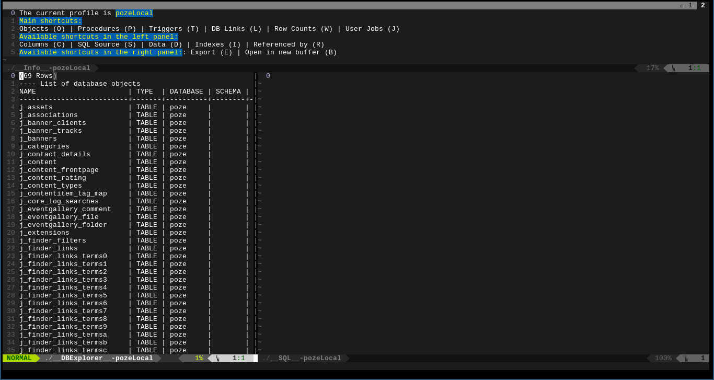
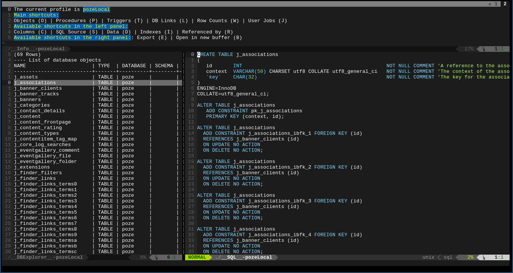
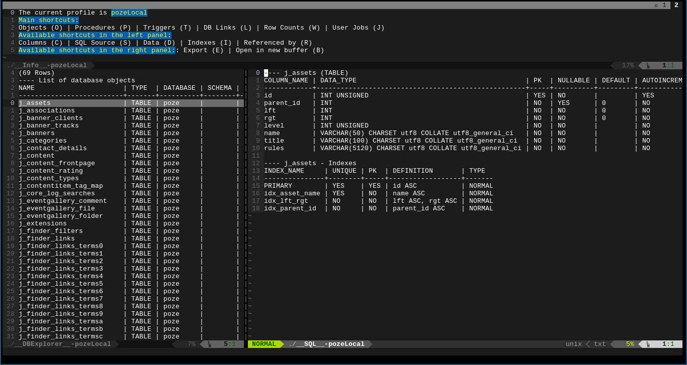
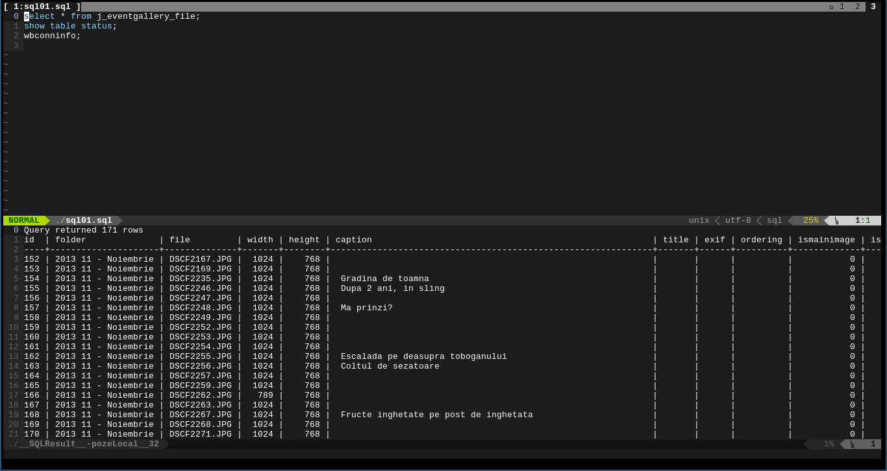
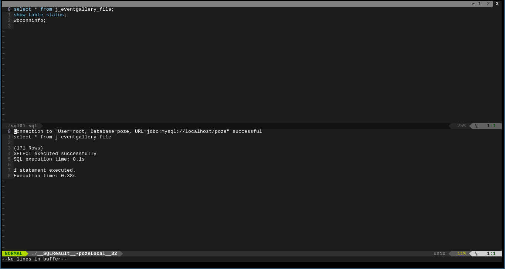

Tutorial
========================================

The following documentation is quite long. If you don't want to read through
it, here is the quick start: 

* install `SQL Workbench/J` from [here](http://www.sql-workbench.net/)
* install your `jdbc` driver for your database see
  [here](http://www.sql-workbench.net/)
* open a terminal window
* `cd ~/.vim/bundle/vim-sql-workbench/resources/py`
* `./sqlwbserver.py -c path/to/sql-workbench/sqlwbconsole.sh -o 5000`
* open vim

*Running sql queries against a DBMS*:

* `:SWSqlConnectToServer 5000 path/to/sql_buffer.sql`
* go to an sql statement
* in normal mode, do `<C-@>` (this is `ctrl` + `space`)

*Opening a database explorer*

* `:SWDbExplorer <my-profile> 5000`

*Note*: 

* `<my-profile>` is the name of a database profile create in `SQL Workbench/J`
  (see [here](http://www.sql-workbench.net/manual/profiles.html))

For more detailed explanations, please continue reading this material.

Introduction
========================================

This is an implementation of [SQL Workbench/J](http://www.sql-workbench.net/)
in VIM. It works with any DBMS supported by `SQL Workbench/J` (PostgreSQL,
Oracle, SQLite, MySQL, SQL Server etc.). See the complete list
[here](http://www.sql-workbench.net/databases.html). 

You can connect to any DBMS directly from VIM.

*Features:*

* database explorer (e.g.: table lists, procedures list, views list, triggers
  list), extensible (you can have your own objects list)
* SQL buffer with performant autocomplete
* export any sql statement as `text`, `sqlinsert`, `sqlupdate`,
  `sqldeleteinsert`, `xml`, `ods`, `html`, `json`
* search in object source
* search in table or views data
* asynchronous (you can execute any command asynchronous)
* fully customizable

CONTENTS:

1. Requirements
2. Connecting to a DBMS
3. The database explorer
4. The SQL Buffer
5. SQL commands
6. Searching
7. Exporting
8. Sessions
9. Variables
10. Commands
11. Settings
12. Screen shots

Requirements
========================================

* `Vim` compiled with `python` support
* `Python` installed on the machine
* `SQL Workbench/J` installed on the machine
* Optional: [`vim dispatch`](https://github.com/tpope/vim-dispatch) plugin
  installed.
* `VIM` started in server mode

Of course you need VIM 7 or above. You also need [`SQL
Workbench/J`](http://www.sql-workbench.net/) installed on your computer. It is
platform independent, since `SQL Workbench` is written in JAVA and it should
work anywhere where VIM works. 

Before getting started, you have to set the `g:sw_exe` vim variable. The
default value is `sqlwbconsole.sh`. If you have `SQL Workbench` in your PATH,
then you can skip this step. Otherwise, just set the value of the variable to
point to your `sqlwbconsole` file. If you are on Windows, it should be
`sqlwbconsole.exe`. 

Also, if you are on Windows, you have to set the `g:sw_tmp` value in your
`vimrc`. The default value is `/tmp`. 

The communication with the DBMS is made through the `sqlwbserver.py` script, that
you can find in the `resources/py` folder of the plugin. This is a `python`
script (hence the need to have `python` installed on the machine) and it will
spawn a `sqlwbconsole` instance in memory and then open a port on which will
listen for requests. After this, whenever you want to send a command to the
DBMS from `VIM`, the plugin will connect on the specified port, send the
command and retrieve the result which will be displayed in `VIM`. 

In order to work properly, you should keep the settings on default. Settings
like `workbench.console.script.showtime` could affect the functionality of
`VIM sql workbench`.

*Note*:

Please note that the last version of the `sqlwbserver.py` script is not
compatible with `SQL Workbench/J` before build 118. To use it with a previous
build, you will have to use the `-O 1` parameter. Also, f you want to use a
version of `SQL Workbench` prior to 118, you have to set the `vim` variable
`g:sw_use_old_sw` to `1`.

Connecting to a DBMS
========================================

First of all, you need to open have a `sqlwbserver` running in memory. There
are two ways to run a server. 

## Starting a server from vim

For this you need to have the `vim dispatch` plugin installed. If you want to
start the server from `vim`, you can call the command `SWServerStart` with the
port on which the server will listen. Also, you can choose a profile for the
new connection. If you don't choose a profile now, you will have to execute
[`WbConnect`](http://www.sql-workbench.net/manual/wb-commands.html#command-connect)
in order to connect to a database. 

For example: `SWServerStart 5000`. 

## Starting a server from command line

If you don't want or you can't install the `vim dispatch` plugin, you can
always start a server from command line. From your terminal, you need to
run the `resources/py/sqlwbserver.py` script. For a list of parameters you can
do `resources/sqlwbserver --help`. The following parameters are mandatory: 

* The path to your `sqlwbconsole` executable (`-c`). 

The default port on which the server will listen is 5000. You can change this
with the `-o` parameter. 

Please note that a server handles only one `sqlwbconsole` instance, which is
not multi threading, so also the server is not multi-threading. Since a
command sent to a DBMS through `sqlwbconsole` cannot be interrupted, there is
no reason to have `sqlwbserver` working multi-threading. A new command will
have to wait anyway for the old one to finish. 

If you want to have several connections to a database, you can open another
server (run again `sqlwbserver`) on another port. Of course, each server will
have it's own opened transactions. You cannot do an `update` on a port and a
`rollback` on the other port. 

Though, when you open a database explorer (which requires a profile), a new
instance of `sqlwbconsole.sh` will be launched on a different thread. So any
commands for the database explorer will be run in parallel with any command
launched from any `vim` buffer connected to the same port. 

*Example*: 

```
`resources/sqlwbconsole -t /tmp -c /usr/bin/sqlwbconsole.sh -o 5000`
```

*Note*:

For `SQL Workbench/J` prior to build 118, please set the `g:sw_use_old_sw`
variable to 1

## Connecting a vim buffer

Once you have a server opened, you can connect any vim buffer to that server
using `SWSqlConnectToServer` command. Once a buffer is connected to a server,
you can send any command from that buffer to the DBMS using the
`SWSqlExecuteCurrent`, `SWSqlExecuteSelected` or `SWSqlExecuteAll` commands. 

The database explorer
========================================

In order to open a database explorer, you need a profile. 

You can create `SQL Workbench` profiles, either by using the `SQL Workbench`
GUI, like
[here](http://www.sql-workbench.net/manual/profiles.html#profile-intro),
either opening a sql buffer with `SWSqlConnectToServer` and then executing
`WbStoreProfile`. 

Once you have your profiles created, you can use `SWDbExplorer` with the
desired profile as argument and you will connect to the database. 

For example, `:SWDbExplorer 5000 myProfile` will open a database explorer
using the profile `myProfile` and the server which listens on the 5000 port. 

The database explorer is composed from three parts: on the top, there is a
list of available shortcuts at any moment. On the bottom left, you will see
the list of objects in your database (the list of tables and views or the list
of procedures or the list of triggers etc.) and on the bottom right, you will
see the selected object desired properties. Like in the second or third screen
shot. 

So, if you want to see the columns of a table, you will have to move the
cursor in the bottom left panel, go to the desired table and press 'C'. This
will display in the right panel the table columns, indices and triggers. If
you want to see its source code, you press 'S' and so on. For all the
available shortcuts, see the top panel. 

The database explorer if fully customizable. You can use the existing one and
extend it or you can create your own from scratch. 

## Creating a new database explorer from scratch

The database explorer is loaded from the `resources/dbexplorer.vim` file by
default. If you want to write your own, set the `g:sw_dbexplorer_panel`
variable to point to your own file and that file will be loaded. The file has
to be a `vimscript` file, since it's going to be sourced and it needs to set
the `g:SW_Tabs` variable. For an example, take a look at the
`resources/dbexplorer.vim` file. 

The `g:SW_Tabs` has to be a vim dictionary. The keys are the profiles for
which the panel will be applied. `*` profile, means that the options appear on
all profiles. If you want to have separate database explorers for separate
profiles, you can create a key in the dictionary for each explorer. 

You can also have profiles per type of DBMS. If you have a profile starting
with a `:` or a '^'.

A `:` means that this options will appear for all the profiles which the DBMS
is of that type. For example `:MySQL` it means that these options will appear
only for `mysql` databases. 

A `^` means that this options will appear for all the profiles for which the
DBMS is not of that type. For example `^PostgreSQL` means that there options
will appear for all databases which are not `PostgreSQL`. 

For this to work, you have to have the option `g:sw_config_dir` set. The
profile informations are read from the `WbProfiles.xml` file which resides in
this folder. The profile type you can see it in the `SQL Workbench/J`
connection window. It's the driver title.

Starting with version `4.0` you can also have a vimscript function called
instead of a sql query. The function called has to return a string which will
be interpreted as the result of the operation. The function will receive as
parameters the line selected (the complete line which has been selected). In
order to have a function instead of a sql query in the database explorer, the
`command` has to begin with `:`. 

For example: 

```
{'title': 'Data', 'shortcut': 'D', 'command': ':My_function'}
```

When the shortcut D will be pressed, the result will be fetch by calling
`My_function(getline('.'))`

Of course, the current line is only relevant only for when changing a tab.
When changing a tab, the current line will contain whatever value is on the
currently line in whatever buffer you are at that moment.

The values for each profile, have to be a list which will contain all the
options for the left panel. For example, in the default one, the database
objects, triggers and procedures. 

Each list of objects of this list is another dictionary, with the following
keys: 

* `title` (the title which will be displayed in the top panel)
* `shortcut` (the shortcut to access it; please note that you can have several
  letters)
* `command` (the sql command which will be executed when selecting the object)
* `panels` (a list of options accessible in the right panel for each selected
  object in the left panel)

The panels are also a list of dictionaries. Each element of the list has the
following keys: 

* `title` (the title which will be displayed in the top panel)
* `shortcut` (the shortcut which will be used to display it)
* `command` (the sql command which will be executed; please note that the sql
  command should contain the `%object%` string, which will be replaced with
  the name of the selected object)

Optional, the panels might contain the following keys: 

* `skip_columns` (a list with the column indices from the result set that
  should not be displayed)
* `hide_header` (if set and `true`, then the header of the result set will not
  be displayed in the bottom right panel)
* `filetype` (if present, the bottom right panel `filetype` will be set
  according when selecting an object in the left panel)

*NOTES*: 

1. In the command that creates the left panel, the object for which you want
   to select the informations in the right panel should always be on the first
   column. The `%object%` string in the column will be replaced by it.
   Alternatively, you can have `%n%` (n being a number from 0 to the number of
   columns in the left panel). If you have `%n%`, this will be replaced by the
   value of that column
2. The command can contain a comment in the format `-- AFTER` at the end.
   Everything following "AFTER" word will be interpreted as a VIM command and
   will be executed after the result has been displayed in the right panel. For
   an example, see the SQL Source panel in the default database explorer vim
   file (`resources/dbexplorer.vim`). 
3. The shortcuts for the left panel (the list of objects) have to be unique.
   They are used to identify the current option selected to be displayed, so
   that the shourtcuts for the left panel are loaded according to the panels.
   However, the shortcuts for the right panel can be the same from one list of
   objects to the other. For example, you can have "O" as shortcut for objects
   list and then for each object you can have "S" for showing the source code.
   Then, you can have "P" for listing the procedures. Again, for each procedure
   you can have again "S" as shortcut for listing the source code of a
   procedure or for something else. 

## Extending the default database explorer

If you are happy with the default options of the database explorer (which are
the same with the ones of `SQL Workbench/J`) but you just want to add your
own, you can do so by extending the default database explorer. 

This is done by calling the `vimscript` function `sw#dbexplorer#add_tab`. The
function takes the following arguments: 

* The profile (the profile for which the option should be active; it can be
  `*` for all profiles)
* The title (this is the title that will appear on the top panel)
* The shortcut (this is the shortcut to access it)
* The command (this is the SQL command to be sent to the DBMS once this option
  is selected)
* The list of panels (the list of properties to be displayed in the bottom
  right split for each object from the list)

The list of panels is an array of dictionaries. Each dictionary has the same
keys as indicated in the previous section for the list of panels. For example,
if you want to add the database links for all the profiles, you have to add
this in your `vimrc`: 

```
call sw#dbexplorer#add_tab('*', 'DB Links', 'L', 'select db_link, username,
created  from user_db_links;', [{'title': 'Show the host', 'shortcut': 'H',
'command': "select host from user_db_links where db_link = '%object%'"}])
```

Now on all profiles, you will have an extra option. Every time when you click
"L" in normal mode, in the bottom left panel you will have a list of database
links from your schema. For each link, you can move the cursor on top of it
and click H. You will see in the right panel the source of the link. 

Every time when "L" is clicked, `vim-sqlworkbench` sends the `select db_link,
username, created from user_db_links;` command to the DBMS. The result will be
a list of database links displayed in the bottom left panel.  When you move
your cursor on top of one of this links and press "H", the plugin sends to
your DBMS `select host from user_db_links where db_link =
'<selected_link_name>';`. The result is displayed in the right panel.

The SQL buffer
========================================

The SQL buffer is a normal `vim` buffer from which you can send SQL commands
to your DBMS and in which you can use the omni completion (&lt;C-x&gt;&lt;C-o&gt;) to have
intellisense autocompletion. 

You can connect an opened vim buffer to a server using the
`SWSqlConnectToServer <port>` command. Or, you can open a buffer which will be
directly connected to a server by specifying the path to the buffer after the
port. For example `SWSqlConnectToServer 5000 /tmp/dbms.sql`

Once in an sql buffer, you have several ways to execute commands against your
DBMS: 

* execute the current SQL
* execute the selected statement
* execute all statements

All the shortcuts for these commands are fully customizable. But to do this,
you cannot just map the commands in `vimrc`. This is because these shortcuts
are mapped local to the sql buffer, or to the result sets buffer. If you want
to change the default shortcuts, you need to define the
`g:sw_shortcuts_sql_buffer_statement` variable or the
`g:sw_shortcuts_sql_results` variable. This variables should point each to a
`vimscript` file which will define the mappings. 

The `g:sw_shortcuts_sql_buffer_statement` variable is used for the sql buffer
itself, while the `g:sw_shortcuts_sql_results` variable is used for the result
set buffer (see the 4th scren shot). 

As soon as a SQL buffer is opened the shortcuts from the
`g:sw_shortcuts_sql_buffer_statement` will be mapped. If the variable is not
set, then the `resources/shortcuts_sql_buffer_statement.vim` file is loaded.
So, have a look at this file for further details. Please note that for
executing the current SQL, the default shortcut is `ctrl + space`.

The same goes for a result set buffer. The shortcuts from the file pointed by
the `g:sw_shortcuts_sql_results` variable are loaded. If the variable is not
set, then the shortcuts from `resources/shortcuts_sql_results.vim` are loaded.
If you want further details, please have a look at this file. 

You can also have comment in the format `-- before <command>` on a single
line. This comments will be parsed by the plugin. If the command begins with a
`:` it will be interpreted as a `vim` command and executed by vim. Otherwise,
the command will be sent to the DBMS when opening the file.

Examples: 

`-- before :SWSqlAutocompleteLoad <file>`

This command will load the intellisense autocomplete options saved in with
`SWSqlAutocompletePersist <file>`. 

`-- before start transaction;`

This command will be sent to the DBMS and will start a new transaction every
time when you open this buffer. 

## Execute the current statement

As stated already, you can press `ctrl + space` in normal or insert mode or
you can have your own shortcut. Alternatively, in normal mode, you can execute
`SWSqlExecuteCurrent` command. 

The statement between the last 2 delimiters will be sent to the server, or
from the beginning of the file until the first delimiter, or from the last
delimiter to the end of the file, depending on where your cursor is placed. 

By default, if you execute `SWSqlExecuteCurrent`, vim will wait for the result
before continuing. If you don't want to wait for the result, you can execute
`SWSqlExecuteCurrent!`. 

*Note*: The default shortcut is mapped using `SWSqlExecuteCurrent!`, which
means that pressing `Ctrl + space` will execute the current command asynchronous. 

## Execute the selected statement

In visual mode, you can press `ctrl + e` or your own custom shortcut.
Alternatively, you can execute the `SWSqlExecuteSelected` command. Please be
careful to delete the range before, if you want to execute the command from
the visual mode. 

The selected text is going to be sent to the DBMS. 

Like before, if you want the command executed asynchronous, you have to use
the exclamation mark after it (`SWSqlExecuteSelected!`). By default, this is
mapped on `ctrl + e`. You can change this mapping.

## Execute all statements

In visual mode, you can press `ctrl + a` or your own custom shortcut.
Alternatively, you can execute the `SWSqlExecuteAll` command. All the buffer
is going to be sent to the DBMS. 

Also here you can use an exclamation mark to execute the command asynchronous,
which is the default mapping. 

## Profiling

Unfortunately, the `SQL Workbench/J` console application does not return the
time that it took for a command to execute. This plugin will try to do some
profiling, but it will report the full time it took for a command to execute.
This means that this time will also include the communication with the
`sqwbconsole` server, the time to display the results in console (if on debug
mode) the time it took `SQL Workbench/J` console application to communicate
with the DBMS via `jdbc` and any other operations involved. 

So, if you want to do some profiling, try to either to `select count(*) from
your_table` (this would eliminate some operations, like displaying the results
in console if in debug mode) or to set the maximum number of results to a low
value (like 10). And (of course), send only one query at a time.

## Intellisense

`vim-sqlworkbench` plugin comes with intellisense out of the box. In order to
take advantage of the auto complete intellisense, you have to execute first
the `SWSqlAutocomplete` command. Depending on how many tables and views you
have in your database, it might take even more than one minute. After the
command is executed, normally you can press &lt;C-x&gt;&lt;C-u&gt; in insert
mode in a sql statement. 

*Note*: due to constant conflicts with dbext plugin (which apparently has some
parts included in the `/usr/share/vim` folder) I prefer to switch to
&lt;C-x&gt;&lt;C-u&gt;. So, you cannot use &lt;C-x&gt;&lt;C-u&gt; anymore for
intellisense

The plugin will try to determine where you are in the sql and return the
appropriate options. For example, if you are in the fields part of a `select`
statement, the options returned will be the fields based on the tables from
the `from` part of the `select`. If you are in the `from` part, then the list
of tables is returned. If you have an identifier followed by a dot, then if
that identifier is a table, a view or an alias of a view or subquery, the
system will return the corresponding list of fields. 

Also the subqueries are parsed and the appropriate fields are returned. 

If you are in a subquery in a bigger query, the auto complete will be executed
at the level of the subquery.

If you are in a `union` `select` statement, the system will try to determine
in which `select` the cursor is placed and execute auto completion for that sql. 

As stated before, enabling the auto completion for a buffer can take some
time. Normally, whenever you execute a `SWSqlAutocomplete`, the data is cached
in memory in vim buffer variables. If you want to persist in on the hard
drive with `SWSqlAutocompletePersist myProfile` command. This will save the
data on hard drive. Later you can reload it with `SWSqlAutocompleteLoad
myProfile`. Combined with `-- before` comments in the file, you can have the
autocomplete loaded every time you open a file. 

If you modify a table then, you can do `SWSqlAutocomplete modified_table`.
This will be very fast, as it will only load the data for the table. You can
sent as many tables at once. Of course, more tables you send, the longer it
will take to complete. For example, you can do `SWSqlAutocomplete
modified_table1 modified_table2`. This will reload the data for
`modified_table1` and `modified_table2`. 

If you drop a table, you can always execute `SWSqlAutocomplete` with the name
of the table preceded by a `-`. This will eliminate the table from the
autocomplete list. For example: `SWSqlAutocomplete -dropped_table`. You can
combine in the same statement adding and deleting of tables. For example:
`SWSqlAutocomplete -dropped_table new_table`. 

You can also execute `SWSqlAutocomplete!`. This will reset any autocomplete
option and will reload again all the tables. 

Unfortunately, the autocomplete for the function and procedures is limited.
This is because `SQL Workbench/J` does not provide also a list of parameters
through a `SQL Workbench` command. I can only retrieve the name of the
function or procedure. Also, the autocomplete for the procedure and functions
is limited to the `WbCall` command. 

*NOTE*: The autocomplete feature is implemented using regular expressions.
Because of using regular expressions, it's possible that I've missed cases. If
you notice any case where the autocomplete is not working properly, please let
me know.

## Get an object definition

When with the cursor on top of any word in the buffer or in the result set,
you can click `alt + i` or your own custom shortcut. This will display that
object definition if the object exists in the result set buffer or an error 
message. 

Alternatively you can execute the `SWSqlObjectInfo` command from normal mode. 

Basically the command `desc <object>` is sent to the DBMS and the output 
returned. 

## Get an object source

When you are with the cursor on top of any word in the buffer or in the result
set, you can click `alt + s` or your own custom shortcut. This will display
the object source if the object exists in the result set buffer or an error 
message.

Alternatively, you can execute the `SWSqlObjectSource` command from normal 
mode.

## Maximum number of rows. 

By default, the maximum number of results returned by a select is 5000. You
can change this with the `set maxrows` command. See
[here](http://www.sql-workbench.net/manual/wb-commands.html#command-set)

## Changing result sets display mode

In the result set buffer, you can click `alt + d` or your own custom shortcut
on top of a row. This will toggle the row display to have each column on a row
for the selected row. To change back the display mode, click again the same 
shortcut. 

Alternatively, you can execute the `WbDisplay` command. See
[here](http://www.sql-workbench.net/manual/console-mode.html) for more detail.

SQL commands
========================================

You can send a sql query to the DBMS from the vim command line using the
command `SWSqlExecuteNow`. The first parameter is the port of the server on
which to execute, and the next parameters are the sql query. Please note that
by default no results will be shown. If you want to see all that happened on
the server side, use the `SWSqlExecuteNowLastResult` command. This will show
you what happened with the last command sent from the vim command line. 

This is useful if you want to put vim shortcuts for simple things. Like, for
example, you could have in your `vimrc`:

```
nnoremap <leader>t :SWSqlExecuteNow 5000 wbdisplay tab;<cr>
```

Then pressing `<leader>t` in normal mode, would set the display to tab for the
instance listening on port 5000.

*Note*: This command will not be recorded in `g:sw_last_sql_query`. The
delimiter is the `;`.

Searching
========================================

`SQL Workbench/J` comes with two very handy and powerful commands:
`WbGrepSource` and `WbGrepData`. `vim-sqlworkbench` takes advantage of both of
them and implements searching options. You can search in objects source code,
or you can search tables data.

## Searching in objects source code

Of course, you can always execute `WbGrepSource` in a sqlbuffer and send it to
the DBMS. For a full documentation of the command, please see
[here](http://www.sql-workbench.net/manual/wb-commands.html#command-search-source).

Alternatively, you can call one of the three `vim-sqlworkbench` search
commands available: `SWSearchObject`, `SWSearchObjectAdvanced` or
`SWSearchObjectDefaults`. 

The `SWSearchObject` command will take one argument, which is the search
string. The command which will be sent to the DBMS is `WbGrepSource
<your_terms>`. This means that you execute a search with `SQL Workbench/J`
default values. For a list of these, see the above link. 

*Example:* `:SWSearchObject my_table<cr>`

The `SWSearchObjectAdvanced` command will open an interactive command prompt
asking for every parameter value, beginning with the search terms.
Additionally, it will also require the columns to be displayed from the search
result. If you want to only search for some objects that contain a certain
term in their definition, you might not want to include the code of the
object. This might take multiple rows. In this case you will have to scroll in
the result buffer to see all the objects containing your term. If this is the
case, you can include only the "NAME" and "TYPE" columns. 

If you leave the columns empty, then the plugin will return all the columns
but will remove all the rows from the source column. Only the first row from
each column will be displayed. If you want to see all the columns with all the
rows, you have to specify all the columns in the columns section
(`NAME,TYPE,SOURCE`). Please note that you cannot change the order of the 
columns. 

The `SWSearchObjectDefaults` command takes one argument (the search terms) and
will perform a search using all the defaults defined in `vim-sqlworkbench`
plugin. These defaults can be changed in `vimrc`. 

*Example:* `:SWSearchObjectDefaults my_table<cr>`

## Searching for data inside tables

You can execute `WbGrepData` in a sql buffer and send it to the DBMS. For a
full documentation of the command, please see
[here](http://www.sql-workbench.net/manual/wb-commands.html#command-search-data).

Alternatively, you can call one of the three `vim-sqlworkbench` search
commands available: `SWSearchData`, `SWSearchDataAdvanced` or
`SWSearchDataDefaults`. 

All the three commands work as their counter parts for searching object with
the exception that no column can be selected any more. 

If you are in an sql buffer, then the results are displayed in the result sets
buffer. If you are in a database explorer, then the search results are
displayed in the bottom right panel. 

Exporting
========================================

`vim-sqlworkbench` takes advantage of the very powerful `SQL Workbench/J`
command, `WbExport`. 

As usual, you can always execute the `WbExport` command inside a sql buffer.
To see the full documentation of the `WbExport` command, have a look
[here](http://www.sql-workbench.net/manual/command-export.html).

*Note*: If you use the wbexport command, you need to send both of the queries
at once, by selecting both queries (first the `WbExport` query and then the
exported query) and then running `SWSqlExecuteSelected`. This happens because
the plugin will send after each statement a silent command to notice vim that
a new result is waiting. So, if you execute `WbExport`, the exported statement
will be the silent one which is void and is not a `select` statement. 

Or you can execute the `SWSqlExport` command. This will open an interactive
input dialog which will ask for the format and the destination file and will
export the last sql command. If you are in a database explorer, in the right
panel, you can click on "E". This shortcut is not modifiable. This will export
what ever is in the right panel, after asking for the format and the
destination file. Please note that because of extra dependencies required for
`xls` export, `vim-sqlworkbench` does not provide support for this format.
However, you can export as `ods`, which is what you should use anyway. See
[here](http://www.fsf.org/campaigns/opendocument/) or
[here](http://www.fsf.org/campaigns/opendocument/download)

Sessions
========================================

`vim-sqlworkbench` provides support for vim sessions. You have to have the
`globals` enabled in your session options (`set sessionoptions+=globals`). 

However, the session restore is done in two steps. As soon as you restore a
vim session, you will notice that for example a database explorer is empty and
pressing the shortcuts will have no effect. You have, when entering in the
tab, to call the command `SWDbExplorerRestore`. 

Similar, when entering an sql buffer after a session restore, you will notice
that executing statements against the DBMS will produce vim errors. Before
executing any statement, you have to call the `SWSqlBufferRestore`. This will
also restore the autocomplete list, so you will also have the autocomplete. 

Variables
========================================

`SQL Workbench/j` supports user defined variables (you can have your queries
sent to the database parameterized). See
[here](http://www.sql-workbench.net/manual/using-variables.html). 

This plugin takes advantage of that and implements a few commands to help you
use variables.

By default, in `SQL Workbench`, the variables are enclosed between `$[` and
`]`. [These can be
changed](http://www.sql-workbench.net/manual/using-variables.html#access-variable). 

You can use `WbVarSet` and `WbVarUnset` in a sql buffer. If you want the
system to ask for a value, then you can use the `$[?` form of a parameter.
Please note that in `VIM Sql Workbench` there is no difference between `?` and
`&`, since there is no way to get a list of vars in `vimscript` from `SQL
Workbench/J`

Commands
========================================

## SWDbExplorer

*Parameters*:

* profile name: the name of the profile for which to open the database explorer. 
* port: the port on which the server listens

Opens a database explorer for the desired profile using the server from the
specified port. 

*NOTE*: If you set the
`g:sw_config_dir` variable to point to the `SQL Workbench/J` settings folder,
the command will autocomplete the profile names. See
[here](http://www.sql-workbench.net/manual/install.html#config-dir)

## SWDbExplorerClose

*Parameters*; 

* profile name (optional): the name of the database explorer that should be
  closed. 

Closes a database explorer. If no profile name is specified, if you are inside
a database explorer, then that database explorer is closed. Otherwise, the
system will generate an error. 

If you specify a profile name, then the database explorer which is opened for
the indicated profile is closed. 

## SWDbExplorerRestore

After a session restore, this command will restore an opened database panel

## SWSqlExecuteCurrent

In an sql buffer executes the current statement. You can execute this command
in normal or insert mode. This is the statement between two consecutive
identifiers, or from the beginning of the file to the first identifier or from
the last identifier to the end of the file. You can change the delimiter using
the `SWSqlDelimiter` command. 

## SWSqlExecuteSelected

In an sql buffer, executes the current selected statement. The command works
in visual mode. Be careful to delete the range before typing the command. 

## SWSqlExecuteAll

Send all sql statements from the buffer to the DBMS. 

## SWSqlToggleMessages

If you have a result set displayed in the result set buffer, you can toggle
between the result displayed and the messages produced by the command with
this command. The command works from the sql buffer and from the result set 
buffer.

## SWSqlObjectInfo

In a sql buffer or in a result set buffer, you can position the cursor on top
of any word and call this command. The plugin will send to the DBMS `DESC
<word>`. If the word that you selected is a valid database object, you will
see its definition. Otherwise it will return an error. 

## SWSqlObjectSource

Like the previous command, if you are with your cursor on top of a word and
call this command, the plugin will return it's source code, if the selected
word is an object in the database. Otherwise, it will return an empty result
set. 

## SWSqlExecuteNow

*Parameters*:

* port: the port on which to execute the command
* sql: The query to be sent to the DBMS

Executes a query against the DBMS on the indicated port.

## SWSqlExecuteNowLastResult

Shows the communication with the server for the last `SWSqlExecuteNow` command.

## SWSqlExport

This command will export the last executed statement. Of course, if your last
statement did not produced any results, you will have an empty file. The
plugin will ask you about the format and about the output file. You can export
in one of the following formats: `text`, `sqlinsert`, `sqlupdate`,
`sqldeleteinsert`, `xml`, `ods`, `html`, `json`. 

## SWSearchObject

*Parameters*:

* search terms: the terms that you are searching.

This command performs a search in the source code of the database objects. It
uses the defaults of `SQL Workbench/J`. The command which is used is
`WbGrepSource`. You can see more details about the parameters and their
default values
[here](http://www.sql-workbench.net/manual/wb-commands.html#command-search-source).

The search result will only return the first row of each column. This means
that you will have to select each term that you want to inspect and see it's
source using the `SWSqlObjectSource` command. If you want to see the full
output you have to either set `g:sw_search_default_result_columns` to
'NAME,TYPE,SOURCE' and execute the command `SWSearchObjectDefaults`, or you
can execute the `SWSearchObjectAdvanced` command and select all three columns
when asked. 

## SWSearchObjectAdvanced

This command will perform an advanced search. It will ask for each possible
parameter. You can cancel the search at any time by replying with an empty
value. This, however, is not possible for the columns input, since the empty
string in the columns means that you want all the columns but only the first
row of each. 

## SWSearchObjectDefaults

*Parameters*:

* search terms: the terms that you are searching. 

This command will perform a search using as default values for all the
parameters the values defined through the vim variables: 

* `g:sw_search_default_regex`
* `g:sw_search_default_match_all`
* `g:sw_search_default_ignore_case`
* `g:sw_search_default_types`
* `g:sw_search_default_compare_types`

## SWSearchData

*Parameters*:

* search terms: the terms that you are searching.

This command performs a search in the data in the tables. It uses the defaults
of `SQL Workbench/J`. The command which is used is `WbGrepData`. You can see
more details about the parameters and their default values
[here](http://www.sql-workbench.net/manual/wb-commands.html#command-search-data).

## SWSearchDataAdvanced

This command will perform an advanced search in the tables data. It will ask
for each possible parameter. You can cancel the search at any time by replying
with an empty value, with the exception of the `excludeTables` parameter,
since an empty value here means that you want to search in all the tables and
is not an unusual request. 

## SWSearchDataDefaults

*Parameters*:

* search terms: the terms that you are searching. 

This command will perform a search in tables data using as default values for
all the parameters the values defined through the vim variables: 

* `g:sw_search_default_ignore_case`
* `g:sw_search_default_compare_types`
* `g:sw_search_default_tables`
* `g:sw_search_default_data_types`
* `g:sw_search_default_exclude_tables`
* `g:sw_search_default_exclude_lobs`

## SWSqlAutocomplete

This command enables the intellisense autocomplete for the current sql buffer.
After this command you can use &lt;C-x&gt;&lt;C-o&gt; for autocomplete. 

You can have as arguments any number of tables from the database to fetch the
autocomplete information only about those tables. You can also precede any
name table with a `-`. In this case, the information will be deleted from the
plugin cache. 

The arguments are useful, if you use the `g:sw_autocomplete_on_load` option. 

## SWSqlBufferRestore

This command will restore the properties of the sql buffer following a vim
session restore. This includes the autocomplete intellisense of the buffer, if
this was active when `mksession` was executed. 

## SWServerStart

*Parameters*:

* the port: the port on which the server will listen
* the profile: optional, you can choose a profile when starting the server

This command will spawn a new server which will launch a `SQL Workbench/J` in
console mode. This can be used if you want to use transactions. 

Please note that you need `vim dispatch` plugin in order to run this from
`vim`. 

## SWServerStop

*Parameters*:

* the port: the port of the server to close. 

This command will stop a server. Also the `SQL Workbench/J` instance in
console mode will be closed. 

## SWSqlConnectToServer

*Parameters*: 

* port: the port of the server
* file name (optional): the name of the file to open. 

This will open a new buffer which will be connected to an existing
`sqlwbconsole` server. If the file name is not specified, then it will connect
the current buffer to the server on the specified port. 

## SWDbExplorerReconnect

Reconnects the database explorer. This is useful if a timeout has occured
while having a database connection opened. Then you call the
`SWDbExplorerReconnect` in order to be able to execute commands again. 

Settings
========================================

## Search object source settings:

* `g:sw_search_default_result_columns`: the default list of columns to be
  included in a search result; default value: ""
* `g:sw_search_default_regex`: whether to use regular expressions or not when
  performing a search; default value: "Y"
* `g:sw_search_default_match_all`: whether to match or not all the search
  terms or only one (use `OR` or `AND` when performing the search); default
  value: "Y"
* `g:sw_search_default_ignore_case`: whether to ignore the case or not when
  performing a search; default value: "Y"
* `g:sw_search_default_types`: the types of object in which to search; default
  value: "LOCAL TEMPORARY,TABLE,VIEW,FUNCTION,PROCEDURE,TRIGGER,SYNONYM"

*Note*: this values apply for the `SWSearchObjectDefaults` command. The
`SWSearchObjectAdvanced` will ask for the value of each parameter and
`SWSearchObject` command will use the defaults of `SQL Workbench`. 

## Search data in tables settings: 

* `g:sw_search_default_match_all`: whether to match or not all the search
  terms or only one (use `OR` or `AND` when performing the search); default
  value: "Y"
* `g:sw_search_default_compare_types`: the type of search to be performed (the
  operator for the search); default value: "contains"
* `g:sw_search_default_tables`: the tables to be included in the search;
  default value: "%", which means all tables
* `g:sw_search_default_data_types`: the types of objects in which to perform
  the search; default value: "TABLE,VIEW"
* `g:sw_search_default_exclude_tables`: the list of tables to exclude from
  search; default value: ""
* `g:sw_search_default_exclude_lobs`: whether or not to exclude the `blob` and
  `clob` columns from search; default value: "Y"

*Note*: this values apply for the `SWSearchDataDefaults` command. The
`SWSearchDataAdvanced` will ask for the value of each parameter and
`SWSearchData` command will use the defaults of `SQL Workbench`. 

To see more about these parameters, see
[here](http://www.sql-workbench.net/manual/wb-commands.html#command-search-source)
and
[here](http://www.sql-workbench.net/manual/wb-commands.html#command-search-data)

## Sql buffer settings: 

* `g:sw_sqlopen_command`: the vim command used by `SWSqlConnectToServer`
  command to open a buffer; possible values: `e|tabnew`; default value: "e",
  which means open with vim `edit` command
* `g:sw_tab_switches_between_bottom_panels`: if set to true, then clicking tab
  in a db explorer will switch between the bottom panels
* `g:sw_autocomplete_cache_dir`: the location where the autocomplete
  information is saved. You'll need to set it on Windows to work. 
* `g:sw_switch_to_results_tab`: If true, then switch to the results buffer
  after executting a query

## Database explorer settings

* `g:sw_default_right_panel_type`: the file type of the bottom right panel
  when not specified; default value: "txt"

## General settings:

* `g:sw_exe`: the location of the `SQL Workbench` executable; default value:
  "sqlwbconsole.sh"
* `g:sw_tmp`: the location of your temporary folder; default value: "/tmp"
* `g:sw_asynchronious`: by default, the commands are executed synchronous; if
  you set this to 1, then the commands will be executed asynchronous 
* `g:sw_vim_exe`: the default VIM executable location; this is used in
  conjunction with the asynchronous mode; default value: `vim`
* `g:sw_delete_tmp`: if true, then delete the temporary files created to
  execute any command. Useful for debugging. You can set it to 0 and check all
  the generated files
* `g:sw_use_old_sw`: if true, then use an older version of `SQL Workbench/J`
  (prior to build 118)

Screen shots
========================================







